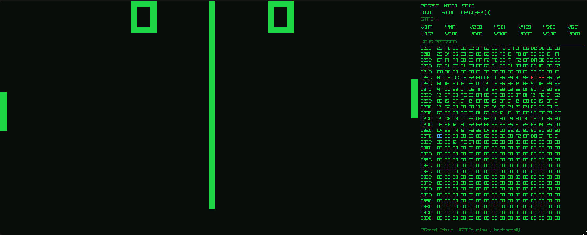

# CHIP8

A CHIP-8 interpreter written in C on top of [Raylib](https://www.raylib.com/),
with a live memory view baked into the emulator window.



## Features

- Full CHIP-8 instruction set
- Live memory + register inspection
- Built-in buzzer (`beep.wav`)
- Ships with 20 classic ROMs in `c8games/`

## ROMs

The emulator loads standard CHIP-8 programs. A collection of public-domain
ROMs is available from [Zophar's pdroms CHIP-8 pack](https://www.zophar.net/pdroms/chip8/chip-8-games-pack.html).

## Build

```sh
make
```

Requires `gcc`, `raylib` and its runtime deps (`libGL`, `libm`, `pthread`).

## Run

```sh
./chip8 <rom>
```

Pick any from `c8games/`, for example:

```sh
./chip8 c8games/TETRIS
./chip8 c8games/PONG
./chip8 c8games/INVADERS
```

## Controls

Mapped to the classic 16-key hex keypad using a 4x4 slice of your QWERTY
keyboard:

```
1234        123C
QWER   ->   456D
ASDF        789E
ZXCV        0ABF
```